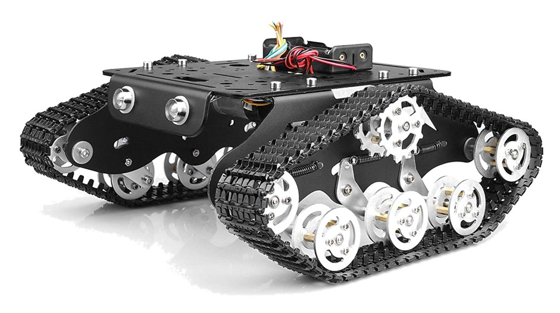

# tankmov
tank controller based on ESP32 WIFI chip. enables PID speed control as well as postion based control &amp; measurements

## Introduction

I use this toy tank to do some experiments on Argos SDR platform. There're some requirements I'm considering:

1. **Accurate position track**. As we do experiments on LTE, which includes a 3.5GHz band with wavelength of ~ 10cm, it's necessary for me to use the magnetic coding to compute the distance moved. 
2. **Speed control**. We do experiments for mobile scenario of MIMO & BF, it must move on a constant speed we defined.
3. **Easy config**. To control the tank on your phone, just a few buttons and input window. You could just flash the firmware onto ESP32 and run it! (probably you need to indicate your WIFI SSID & password in the source code)

## Implementation

### 1. Network controller

just implement a web server with POST and GET http supported.

**not implement a WebSocket version though it might be better with bidirectional communication**

### 2. PID control

using MATLAB ` AutotunerPID Toolkit `

it has been ported to Arduino "https://playground.arduino.cc/Code/PIDAutotuneLibrary"

## Dependencies

Arduino

ESP32 for Arduino

PlatformIO (on vscode), this is for embedding html file into firmware automatically

